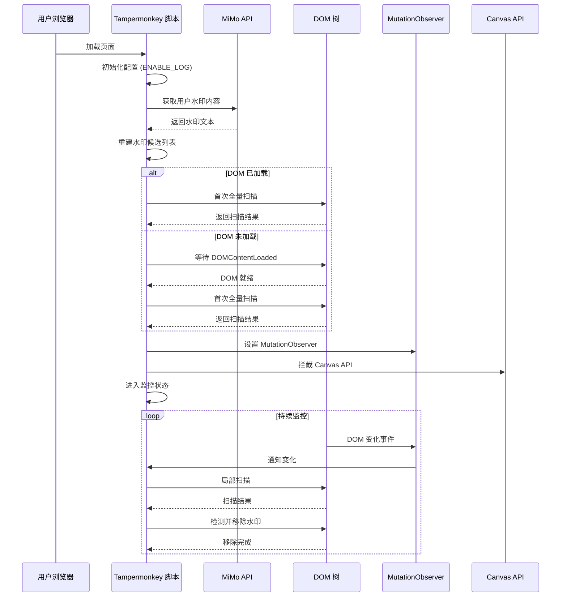
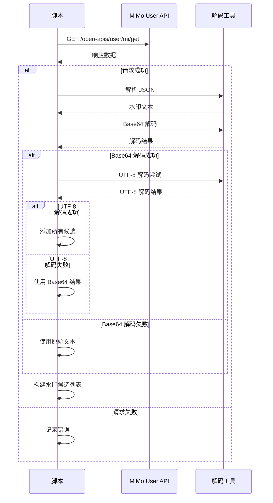
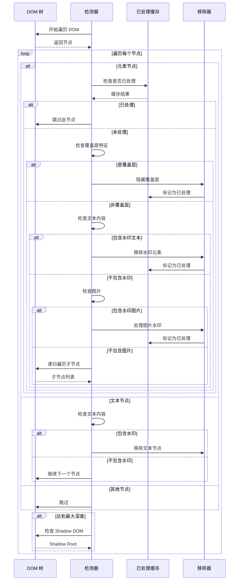
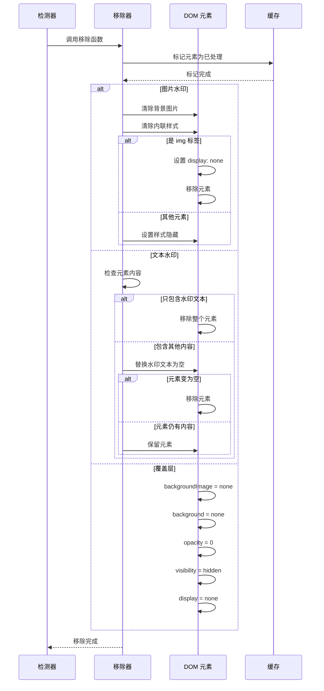
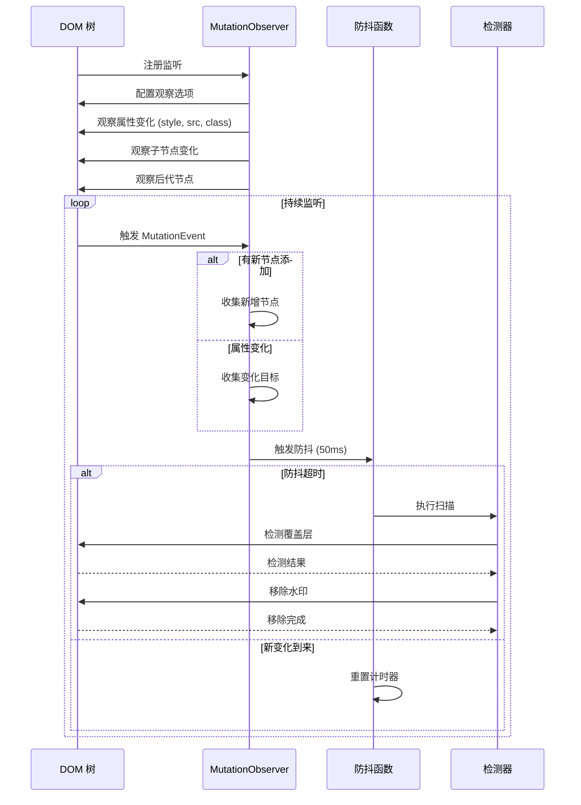
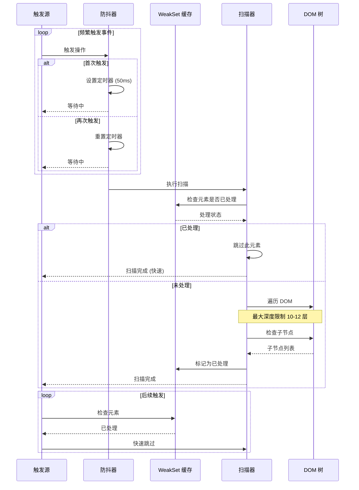
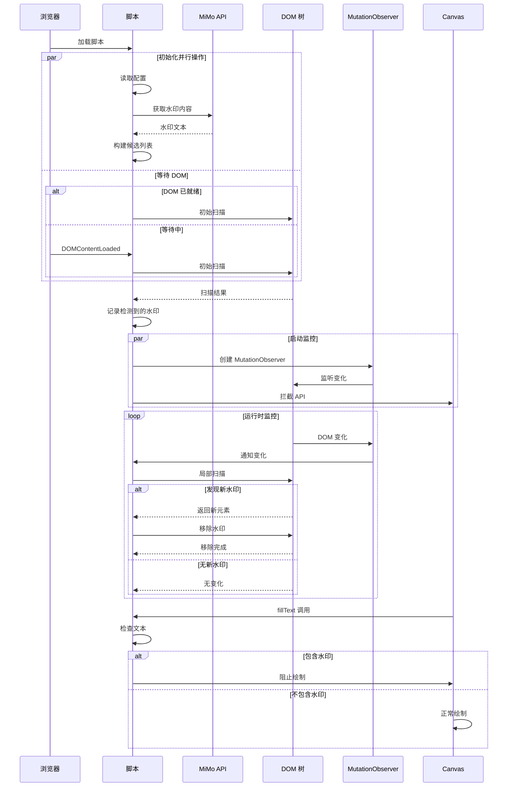

# Xiaomi MiMo Studio 去水印脚本 - 时序图文档

本文档包含项目的时序图，展示脚本各组件之间的时间交互关系。

## 1. 整体架构时序图

## 2. 水印获取时序图

## 3. 水印检测时序图

## 4. 水印移除时序图

## 5. DOM 监听时序图

## 6. Canvas 拦截时序图

## 7. 覆盖层检测时序图

## 8. 性能优化时序图

## 9. 完整交互时序图

这些时序图全面展示了 Xiaomi MiMo Studio 去水印脚本的组件交互和执行流程。
