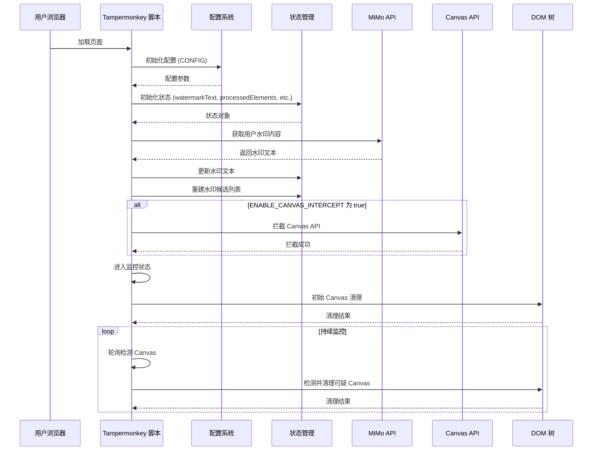
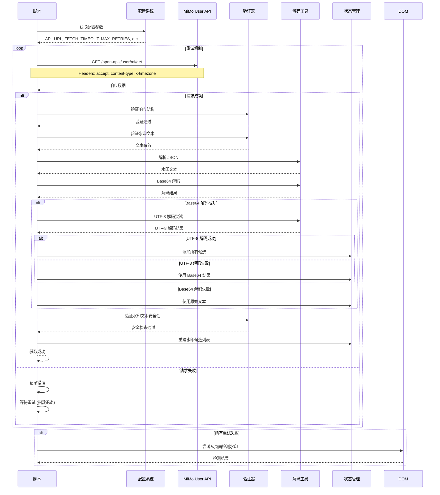
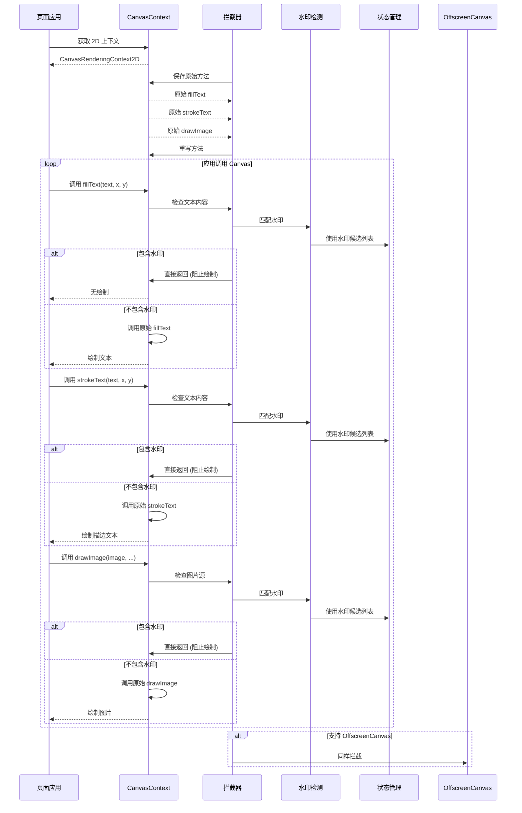
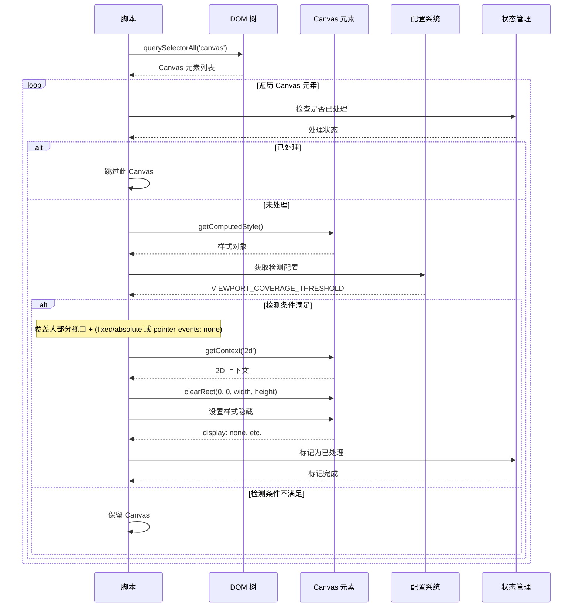
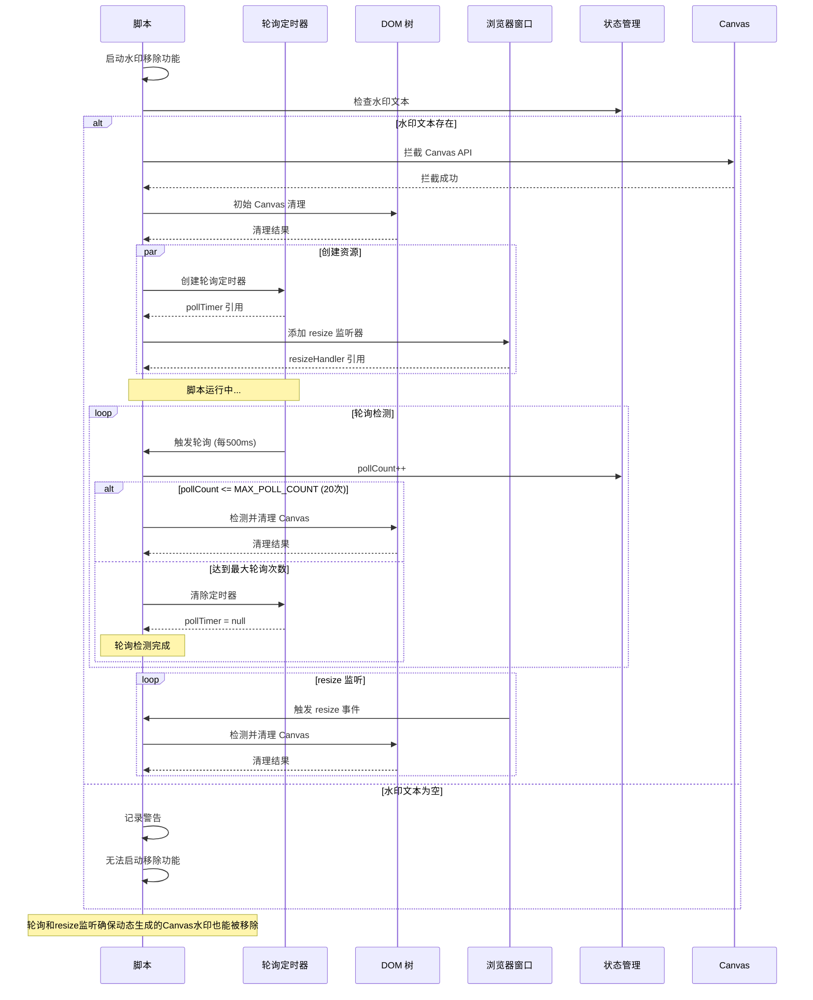
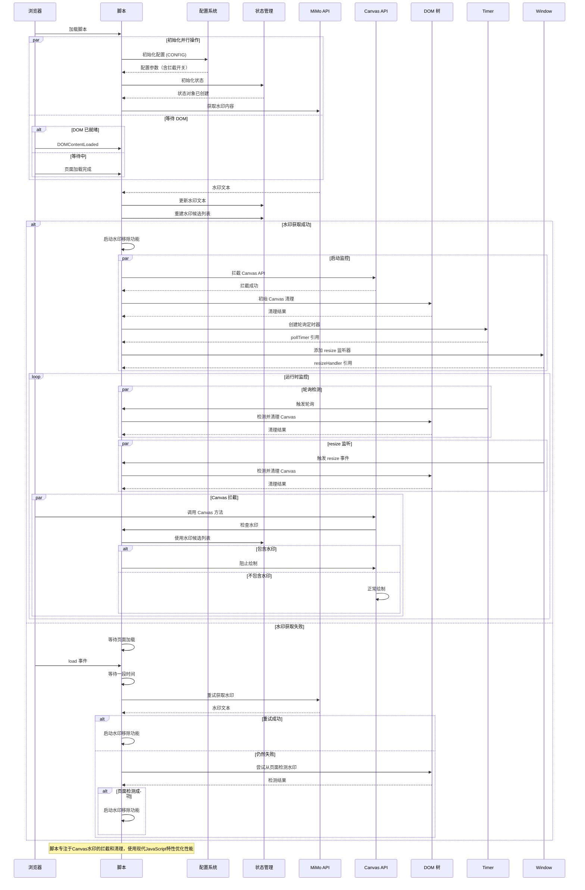

# Xiaomi MiMo Studio 去水印脚本 - 时序图文档

**版本**: v1.4.0 | **更新日期**: 2026-01-20

本文档包含项目的时序图，展示脚本各组件之间的时间交互关系。

## 文档更新说明

### v1.4.0 更新内容
- 完全重写时序图，专注于Canvas水印拦截和清理
- 移除所有DOM遍历、CSS拦截、MutationObserver等已废弃功能的时序图
- 新增Canvas拦截时序图，展示fillText、strokeText、drawImage的拦截流程
- 新增Canvas清理时序图，展示可疑Canvas的检测和清理流程
- 新增水印获取时序图，展示API请求和页面检测备选方案
- 新增动态监听时序图，展示轮询和resize监听机制
- 新增完整交互时序图，展示从脚本启动到水印移除的完整流程

## 1. 整体架构时序图

## 2. 水印获取时序图

## 3. Canvas 拦截时序图

## 4. Canvas 清理时序图

## 5. 动态监听时序图

## 6. 完整交互时序图

这些时序图展示了 v1.4.0 版本的Canvas专用架构，专注于水印的拦截和清理功能。
