# Xiaomi MiMo Studio 去水印脚本 - 时序图文档

**版本**: v1.3.6 | **更新日期**: 2026-01-04

本文档包含项目的时序图，展示脚本各组件之间的时间交互关系。

## 文档更新说明

### v1.3.6 更新内容
- 重构覆盖层检测时序图，展示函数拆分后的辅助函数调用流程
- 更新 DOM 监听时序图，包含 Shadow Root 样式缓存清理逻辑
- 更新水印获取时序图，简化 API 请求 headers
- 更新完整交互时序图，添加配置开关控制流程
- 更新性能优化时序图，展示预过滤优化
- 更新水印移除时序图，改进超时检查逻辑
- 添加配置开关时序图，展示原型链拦截的启用/禁用控制

### v1.3.5 更新内容
- 添加配置系统 (CONFIG) 相关时序图
- 添加样式缓存 (WeakMap) 相关时序图
- 添加清理机制 (cleanup) 时序图
- 添加安全验证时序图
- 更新水印检测时序图，展示迭代遍历
- 更新性能优化时序图，展示缓存机制
- 更新完整交互时序图，包含所有新组件
- 修正清理机制时序图，反映实际实现（仅清除定时器和事件监听器）
- 修正覆盖层检测时序图，包含MAIN和ASIDE标签类型
- 移除整体架构和完整交互时序图中的页面卸载cleanup调用说明

## 1. 整体架构时序图

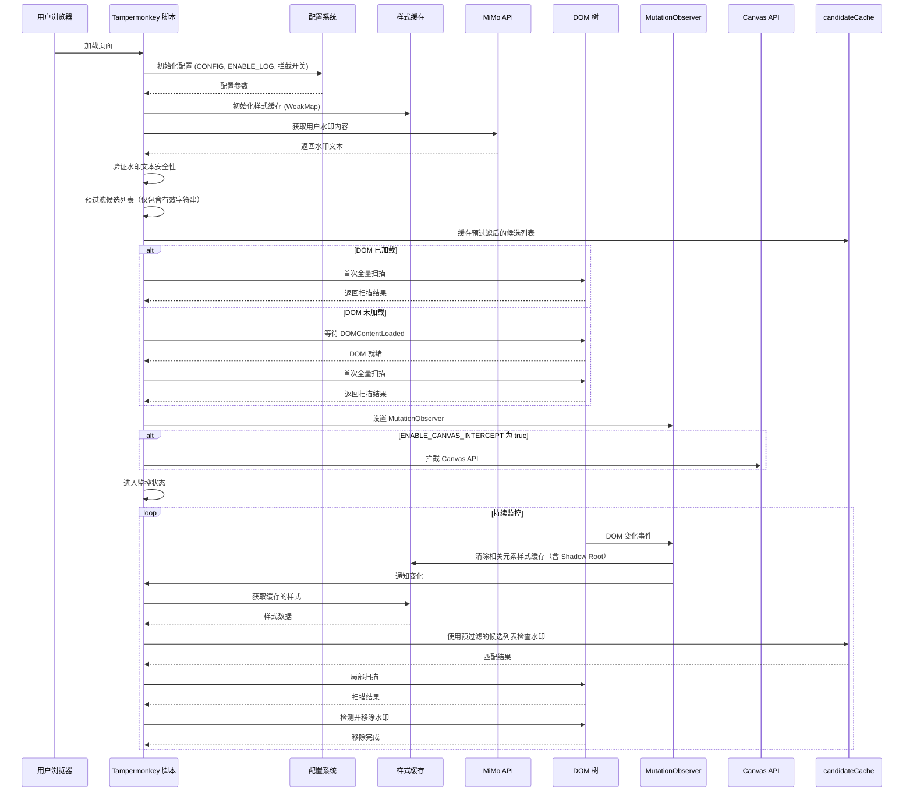

## 2. 水印获取时序图

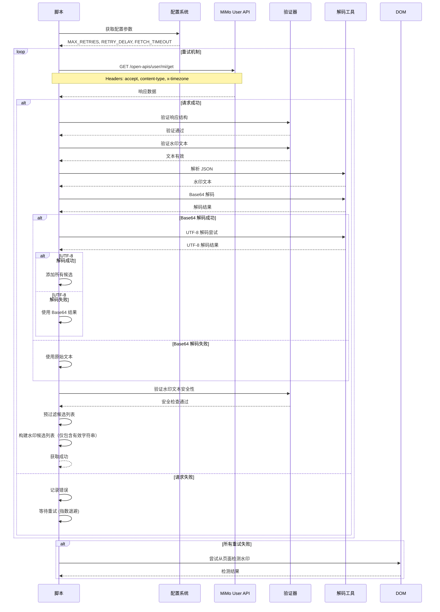

## 3. 水印检测时序图

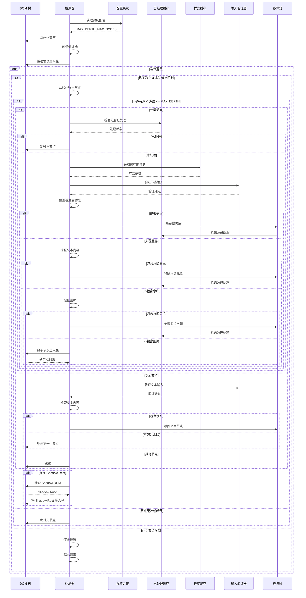

## 4. 水印移除时序图

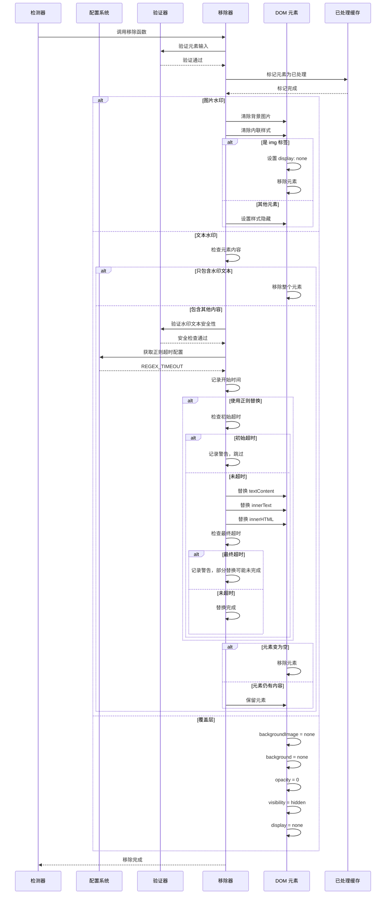

## 5. DOM 监听时序图

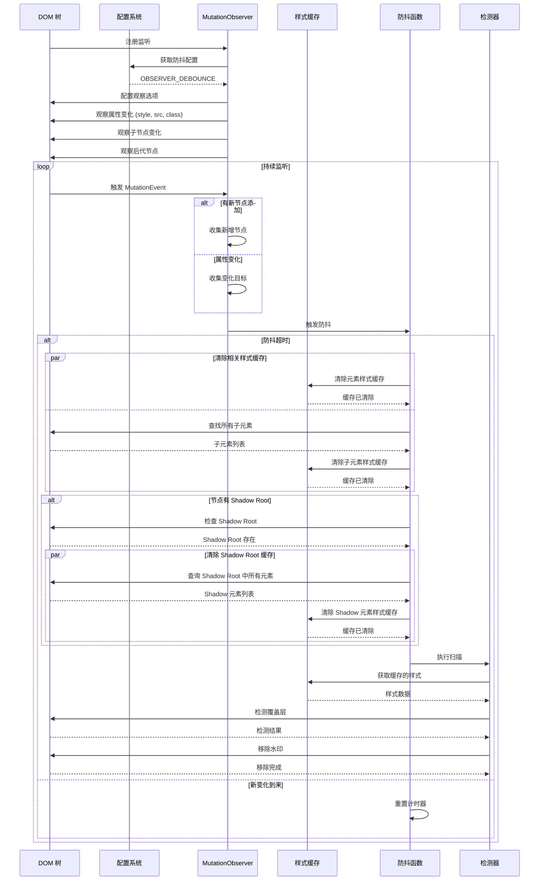

## 6. Canvas 拦截时序图

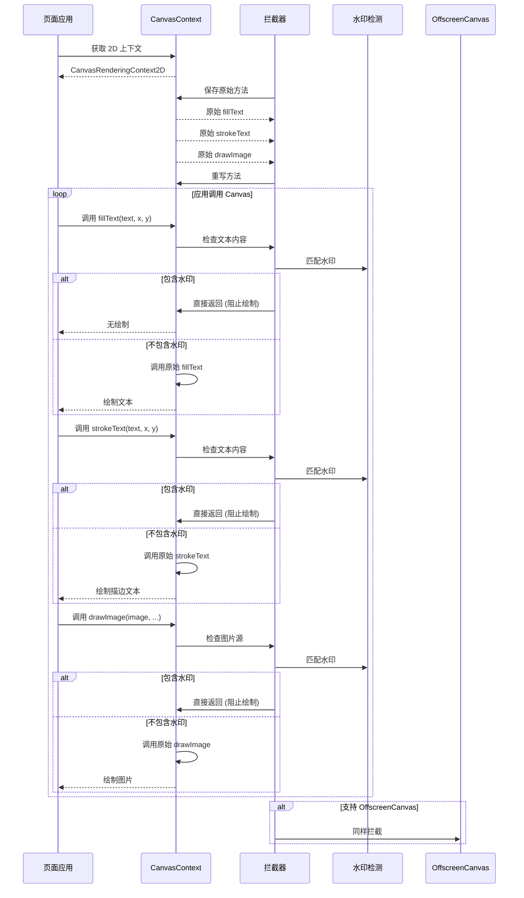

## 7. 覆盖层检测时序图

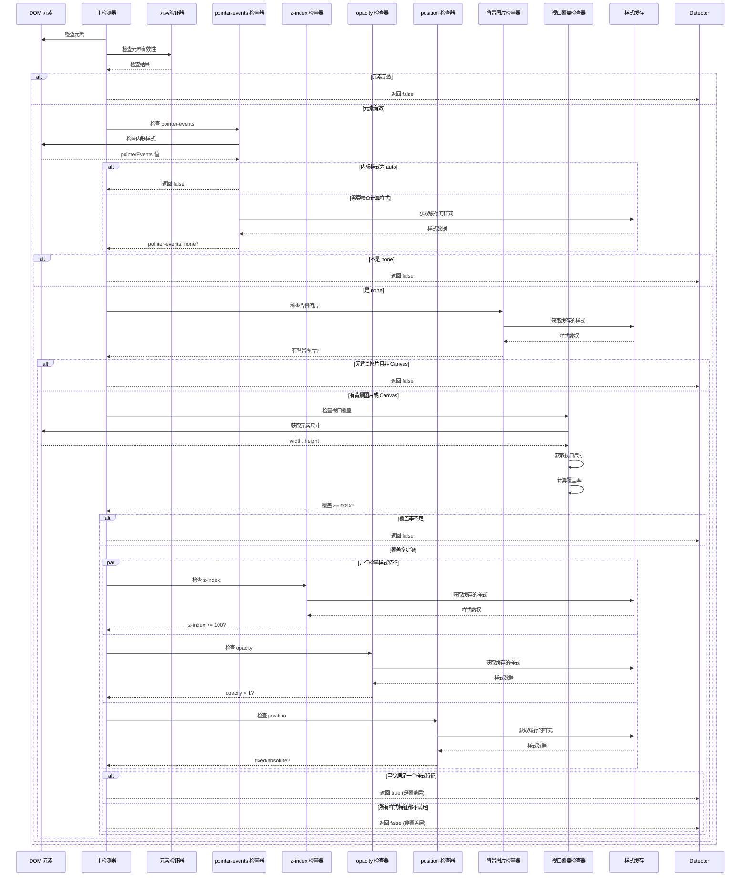

## 8. 性能优化时序图

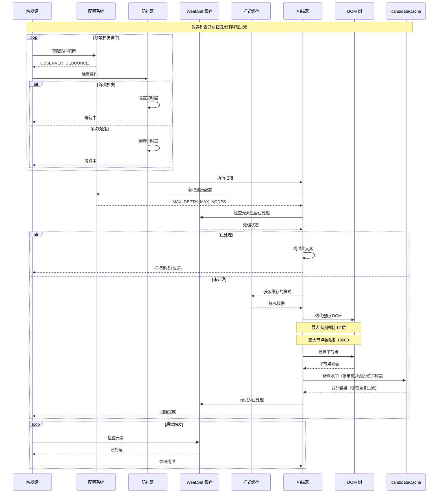

## 9. 完整交互时序图

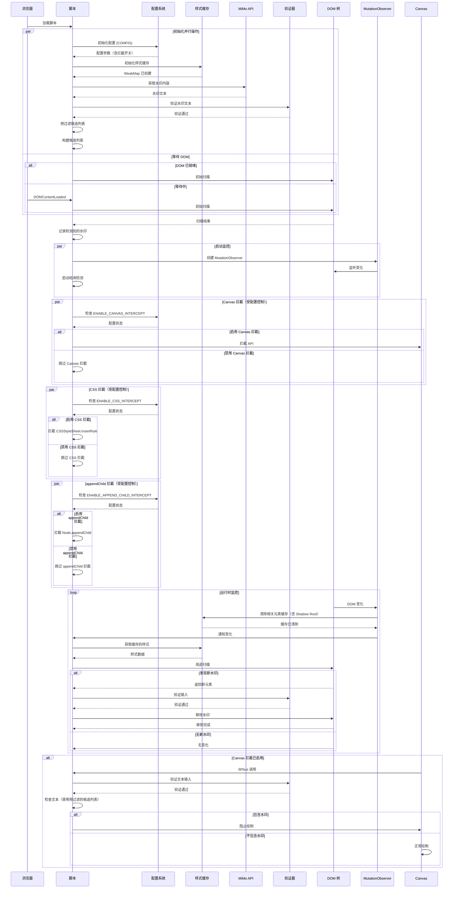

## 10. 清理机制时序图

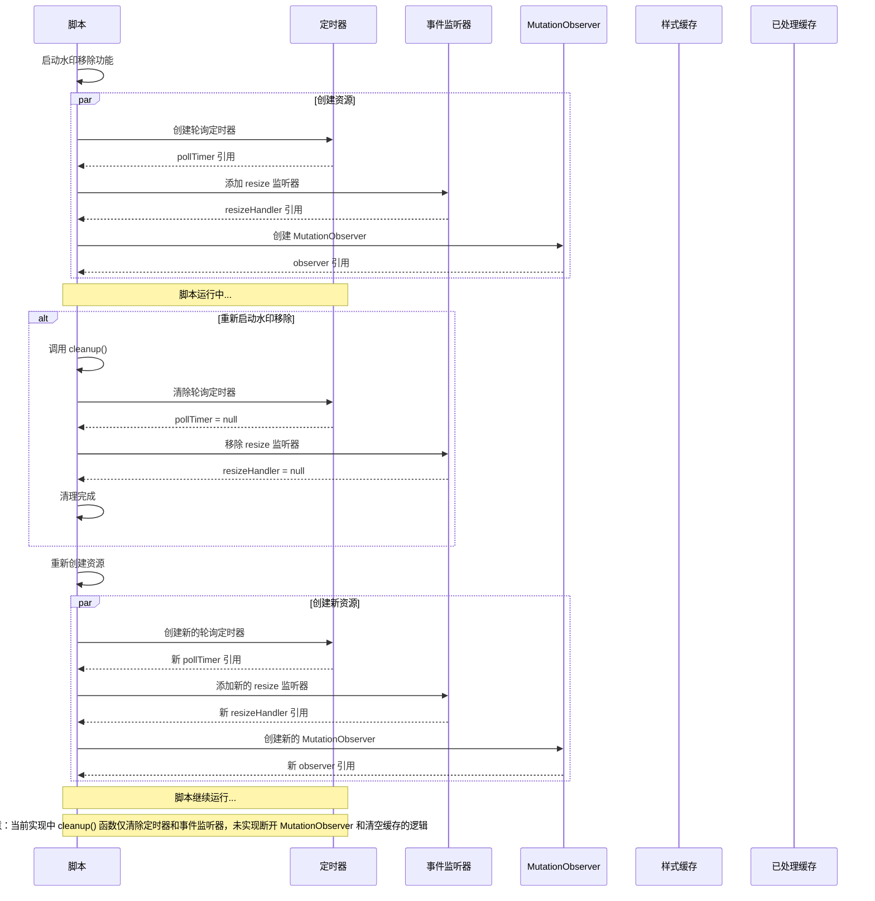

## 11. 安全验证时序图

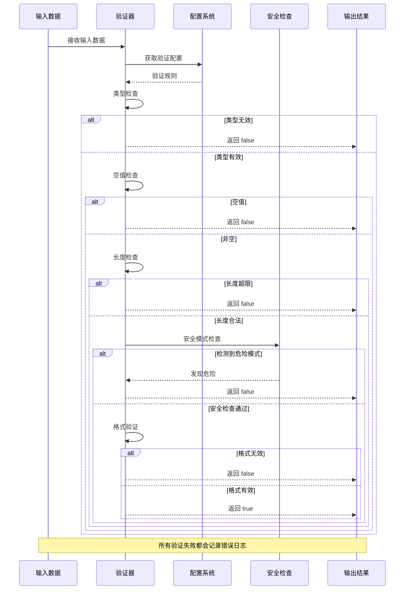

## 12. 配置开关时序图

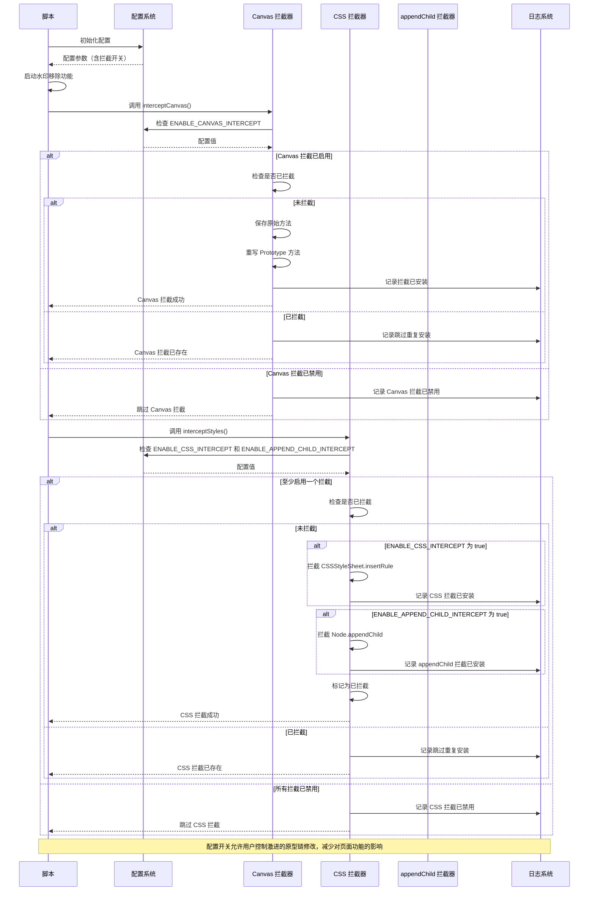

这些时序图全面展示了 Xiaomi MiMo Studio 去水印脚本的组件交互和执行流程。
